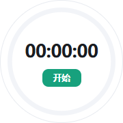
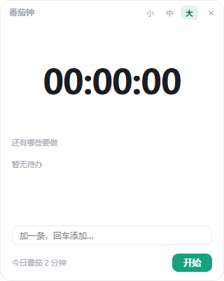
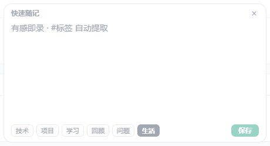
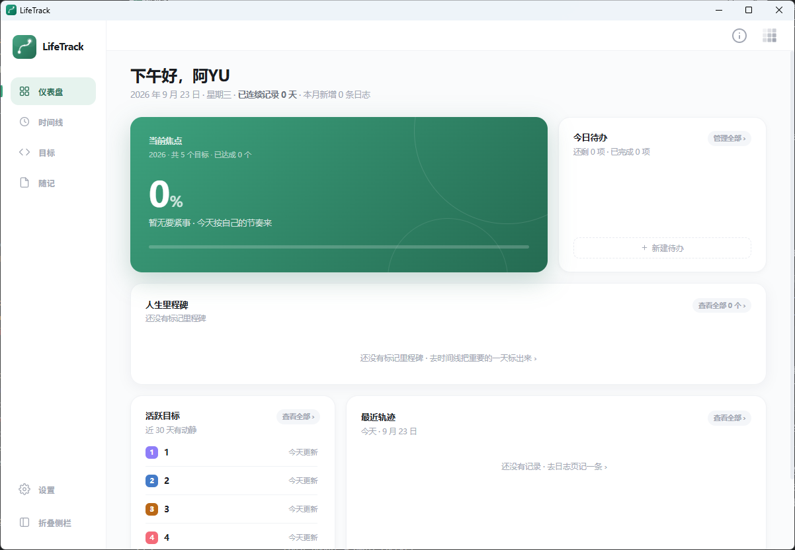
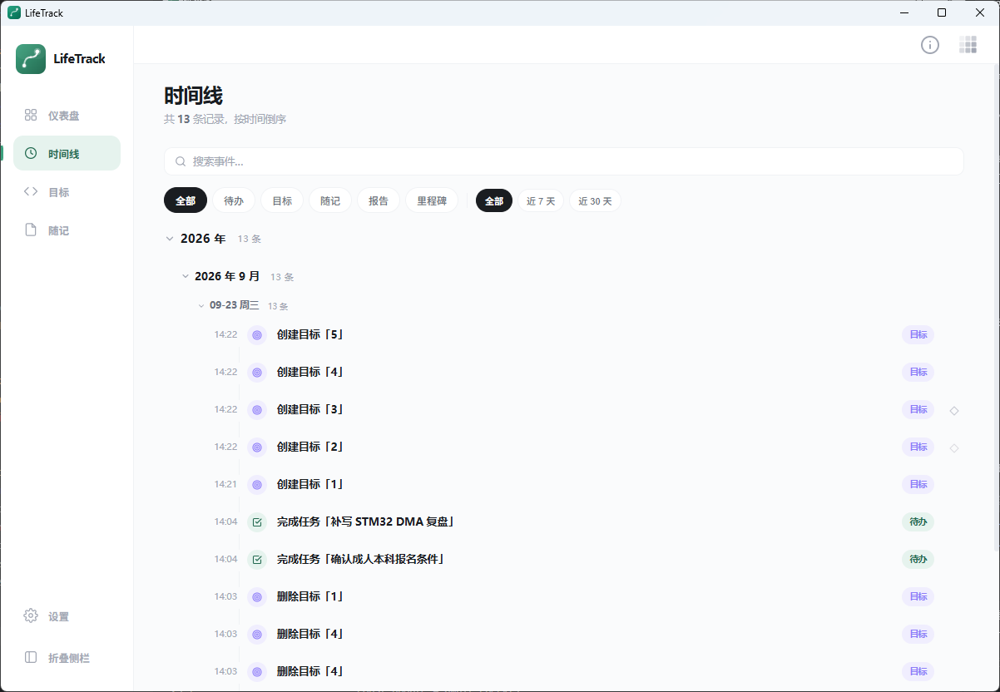
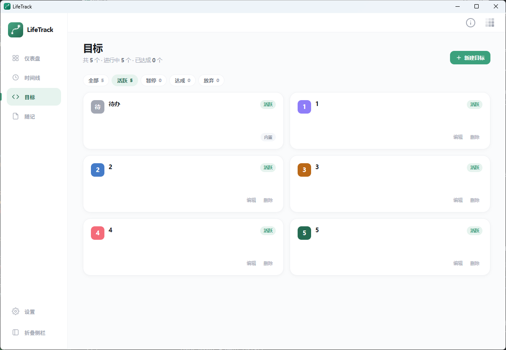
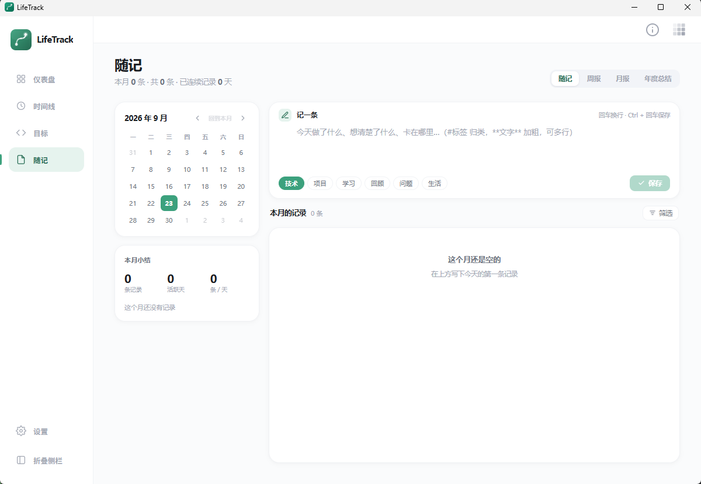

# LifeTrack

> 自知者明，观复知常。以时间线为轴，记录你的随想、专注与成长。

LifeTrack 是一款**本地、离线、以时间线为轴**的个人生活档案桌面应用。每天记一句随记，把值得单独追踪的一段投入立成一个目标，重要的日子在时间线上标成里程碑，周报 / 月报 / 年度总结帮你回望来路——数字实时从记录里聚合，你只负责写下那一句。它不逼你写长文，也只把当下该看的放在首页；一切数据都存在你自己电脑上。自己造，自己用。

> 设计思想：只有一条时间轴，随记、待办、目标、里程碑、报告皆是它在不同尺度上的投影——先落笔下那一句，意义留到回放时再认定。

> 设计哲学详见 [以时间线为轴](./以时间线为轴.md)：随记是实体，其余皆视图。

## 功能特性

- **首页总览**：打开即见今日待办、活跃目标、最近轨迹与里程碑，只看当下该看的事
- **随记**：随手记一句灵感或思考，支持标签分类、关联目标、关键词检索
- **目标与待办**：为一段投入建立目标，拆解任务跟踪进展，每个动作都会在时间线留痕
- **时间线**：所有操作按天折叠展示，重要的日子可标记为里程碑
- **周期报告**：周报 / 月报 / 年报，帮你回望来路、看见成长
- **记录热力图**：近半年记录密度一目了然，看清生活节奏
- **悬浮球**：贴边吸附、悬停展开，一键唤起随记或番茄钟，有感即录不用打开主界面
- **快速随记**：浮窗敲一行即录，自动识别标签与分类
- **番茄钟**：三档浮窗（胶囊/圆环/面板），专注结束后记录做了什么，今日累计一目了然
- **本地存储**：一切数据存在你自己电脑上，完全离线，不联网、不上传

## 免责声明

本工具为个人开发，不保证完全无缺陷。使用前请自行评估风险，开发者不对因误操作或通信异常导致的设备损坏或数据丢失承担责任。

## 更新记录

> 版本号说明：主版本.次版本.修订号。主版本：架构大改；次版本：新增功能；修订号：缺陷修复。

### v0.3.0（2026-09-26）

- 支持应用内在线升级：检测到新版本后一键更新，无需手动下载安装。
- 番茄钟新增暂停：小 / 中 / 大三档均可随时暂停与继续，暂停时段不计入专注时长。
- 番茄钟入口更克制：从托盘或悬浮球打开后不再自动计时，改由你手动开始。
- 番茄钟小档胶囊更贴合内容，开始与暂停时宽窄过渡自然。
- 修复专注不足一分钟结束时，计时数字未归零的问题。

### v0.2.1（2026-09-25）

- 验证应用内自动更新：旧版本可直接检测到本版本并一键升级，无需手动重装。
- 维护性版本，无功能变更；所有数据仍存于本机，不受升级影响。

### v0.2.0（2026-09-25）

- 新增时间线：所有操作按天折叠展示，支持里程碑标记。
- 新增目标与待办：创建目标、拆解任务、跟踪进展，每个动作都会留痕。
- 新增随记：随手记录灵感与思考，支持分类和标签。
- 新增番茄钟：小胶囊、中圆环、大面板三档浮窗，专注结束后记录做了什么。
- 新增悬浮球：贴边吸附、悬停展开快捷入口，一键触达随记和番茄钟。
- 新增周期报告：周报 / 月报 / 年报，同一条时间轴的缩放视图。
- 支持浅色 / 深色主题切换，所有窗口实时同步。
- 支持自定义数据库存储路径。
- 系统托盘常驻，支持全局快捷键。
- 所有数据本地存储，不联网、不上传。

界面预览：

| 番茄钟小档 | 番茄钟中档 | 番茄钟大档 |
| :---: | :---: | :---: |
|  |  |  |

| 悬浮球 | 悬浮球展开 | 快速随记 |
| :---: | :---: | :---: |
|  |  |  |

### v0.1.0（2026-09-23）

- 项目初始化，搭建基础框架。
- 确定产品定位与设计理念，撰写开发计划。

界面预览：

| 仪表盘 | 时间线 |
| :---: | :---: |
|  |  |

| 目标 | 随记 |
| :---: | :---: |
|  |  |
