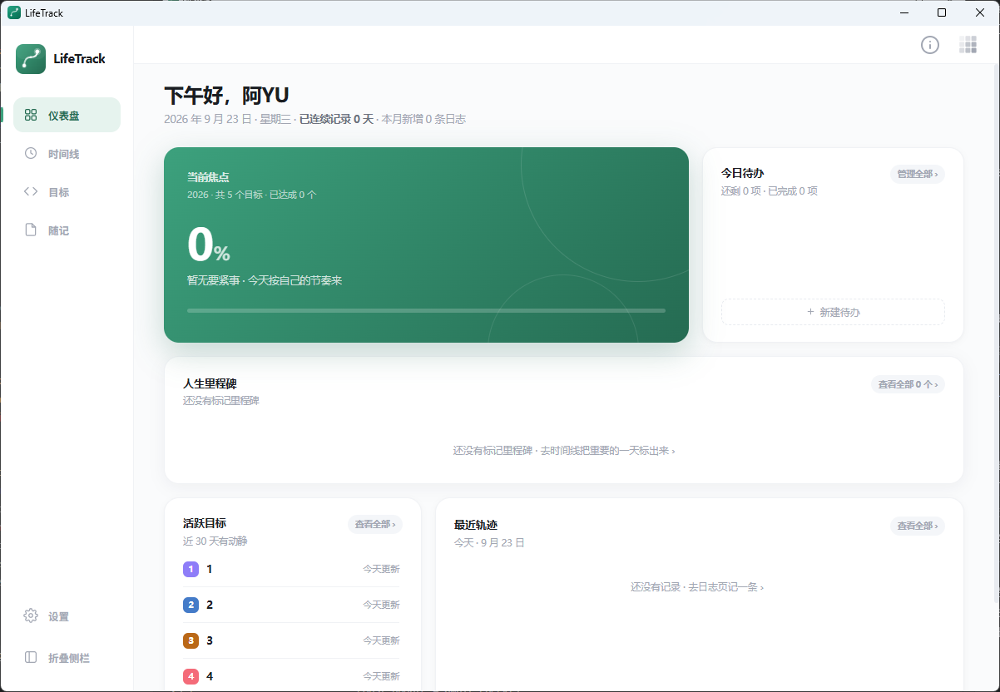
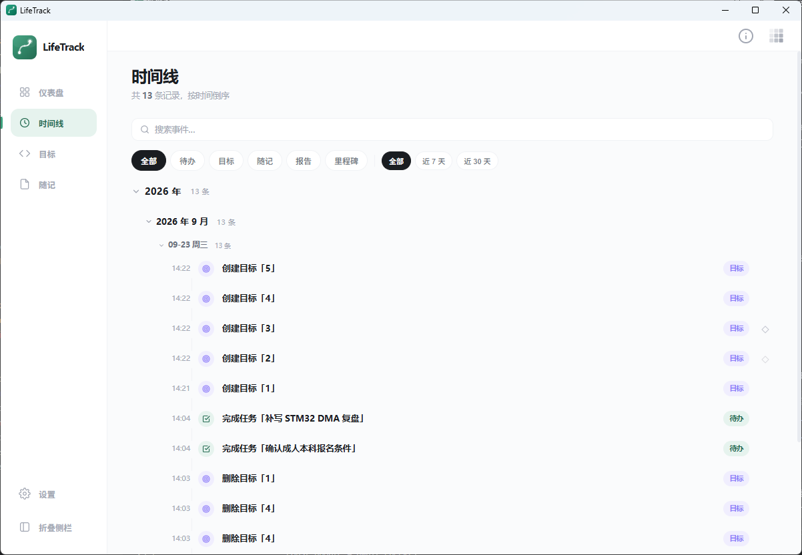
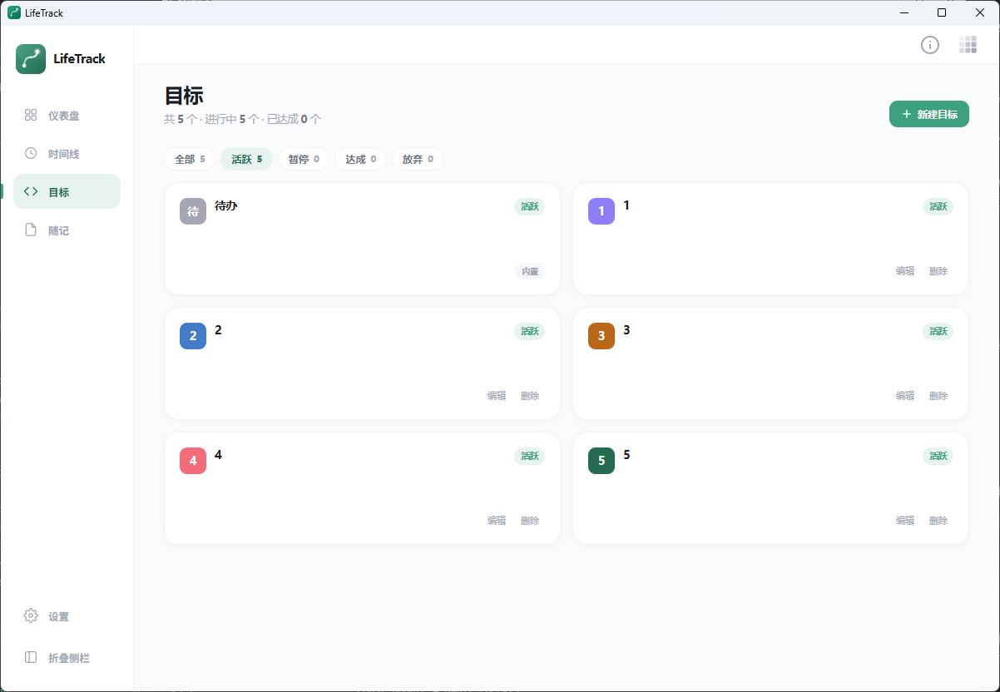
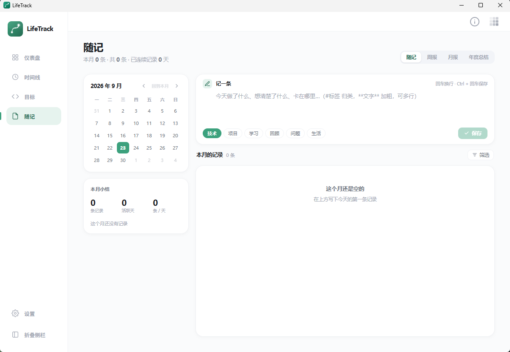
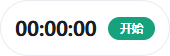
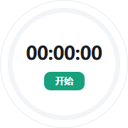
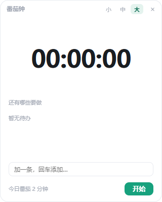
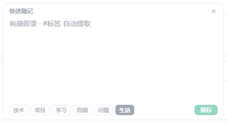

# LifeTrack

> 自知者明，观复知常。以时间线为轴，记录你的随想、专注与成长。

**一台纯本地的 Windows 生活档案台。** 待办、随记、目标、时间线、番茄钟与贴边悬浮球——有感即录，随时待命，不必打开主界面。

[下载 Windows 版](https://github.com/read-April/LifeTrack/releases/latest) · [更新日志](./CHANGELOG.md) · [从源码运行](#从源码运行) · [反馈问题](https://github.com/read-April/LifeTrack/issues/new)


LifeTrack 是一款**本地、离线、以时间线为轴**的个人生活档案桌面应用。每天记一句随记，把值得单独追踪的一段投入立成一个目标，重要的日子在时间线上标成里程碑，周报 / 月报 / 年度总结帮你回望来路——数字实时从记录里聚合，你只负责写下那一句。它不逼你写长文，也只把当下该看的放在首页；一切数据都存在你自己电脑上。自己造，自己用。

> 设计思想：只有一条时间轴，随记、待办、目标、里程碑、报告皆是它在不同尺度上的投影——先落笔下那一句，意义留到回放时再认定。

> 设计哲学详见 [以时间线为轴](./以时间线为轴.md)：随记是实体，其余皆视图。

## 功能特性

- **首页总览**：打开即见今日待办、活跃目标、最近轨迹与里程碑，只看当下该看的事
- **随记**：随手记一句灵感或思考，支持标签分类、关联目标、关键词检索
- **目标与待办**：为一段投入建立目标，拆解任务跟踪进展，每个动作都会在时间线留痕
- **时间线**：所有操作按天折叠展示，重要的日子可标记为里程碑
- **周期报告**：周报 / 月报 / 年报，帮你回望来路、看见成长
- **记录热力图**：近半年记录密度一目了然，看清生活节奏
- **悬浮球**：贴边吸附、悬停展开，一键唤起随记或番茄钟，有感即录不用打开主界面
- **快速随记**：浮窗敲一行即录，自动识别标签与分类
- **番茄钟**：三档浮窗（胶囊/圆环/面板），专注结束后记录做了什么，今日累计一目了然
- **本地存储**：一切数据存在你自己电脑上，完全离线，不联网、不上传

## 界面预览

| 仪表盘 | 时间线 |
| :---: | :---: |
|  |  |

| 目标 | 随记 |
| :---: | :---: |
|  |  |

| 番茄钟小档 | 番茄钟中档 | 番茄钟大档 |
| :---: | :---: | :---: |
|  |  |  |

| 悬浮球 | 悬浮球展开 | 快速随记 |
| :---: | :---: | :---: |
|  |  |  |

## 安装与升级

- **首次安装**：到 [Releases](https://github.com/read-April/LifeTrack/releases/latest) 下载 `LifeTrack_x.y.z_x64_en-US.msi`，双击安装（途中弹一次系统确认属正常）。
- **日常升级**：装好后不必再手动下载，打开应用「设置 → 检查更新」，发现新版一键完成。
- **数据在哪**：全部记录都存在你自己电脑上，存储路径可在设置页查看与更改；不联网、不上传。

## 从源码运行

在 `LifeTrack` 目录下执行（需先装好 Node.js 与 Rust 工具链）：

```bash
npm install         # 安装依赖
npm run tauri dev   # 开发预览
npm run tauri build # 打安装包
```

## 免责声明

本工具为个人开发，不保证完全无缺陷。使用前请自行评估风险，开发者不对因误操作或通信异常导致的设备损坏或数据丢失承担责任。

## 更新记录

> 这里只留最新版要点，完整历史见 [更新日志](./CHANGELOG.md)。

### v0.5.0（2026-09-27）

- 修复番茄钟窗口的待办列表不同步：主界面删除、放弃或完成待办后，它即时跟上，无需关窗重开。
- 修复番茄钟大档里的对勾点下去没反应：勾选完成、新建待办如今都能正常操作，且与主界面一样在时间线留痕。
- 首页、目标墙与目标详情页的待办实时同步，任何地方改动都不用切页刷新。
- 待办页新增长期未清理的收纳之道：本月前结束的自动收起，可展开回看，也可一键只清更早项，本月内的保留反悔余地。
- 番茄钟小、中、大档切换时新增弹入动效，从屏幕锚角生长而出，不再是硬切。

## 许可证

本项目采用 [MIT 许可证](./LICENSE)：你可以自由使用、修改、再分发，保留原作者声明即可。
